```{r setup, echo=FALSE}
knitr::opts_chunk$set(echo=FALSE, comment="")
suppressMessages(suppressWarnings(library(dplyr)))
suppressMessages(suppressWarnings(library(knitr)))
suppressMessages(suppressWarnings(library(magrittr)))
suppressMessages(suppressWarnings(library(stringr)))
```

```{r hw-03.sas}
opts_current$get("label") %>%
  readLines() -> txt
txt %>% 
  str_which(fixed("****")) -> b
n <- length(b)
txt[b] %>%
  str_remove(fixed("**** ")) %>%
  str_remove(" .*") -> section_names
section_start <- b[-n] + 2
section_end   <- b[-1] - 2
for (i in 1:(n-1)) {
  txt %>%
    extract(section_start[i]:section_end[i]) %>%
    paste(collapse=" \n") -> section_txt
  assign(section_names[i], section_txt)
}
```

### hw-03, preliminaries, part 1

```{}
`r sas_code_p1`
```

<div class="notes">

`r comments_p1`

</div>

### hw-03, preliminaries, part 2

```{}
`r sas_code_p2`
```

<div class="notes">

`r comments_p2`

</div>

### hw-03, preliminaries, part 3

```{}
`r sas_code_p3`
```

<div class="notes">

`r comments_p3`

</div>

### hw-03, preliminaries, part 4

```{}
`r sas_code_p4`
```

<div class="notes">

`r comments_p4`

</div>

### hw-03, preliminaries, output

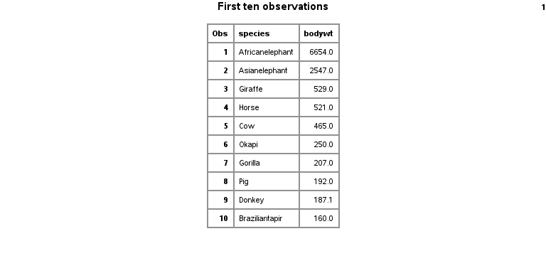

### hw-03, question 1, part a, code

```{}
`r sas_code_q1a`
```

<div class="notes">

`r comments_q1a`

</div>

### hw-03, question 1, part a, output

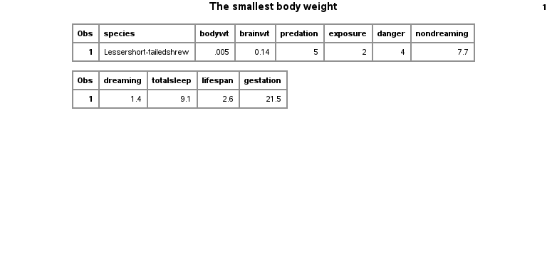

### hw-03, question 1, part b, code

```{}
`r sas_code_q1b`
```

<div class="notes">

`r comments_q1b`

</div>

### hw-03, question 1, part b, output

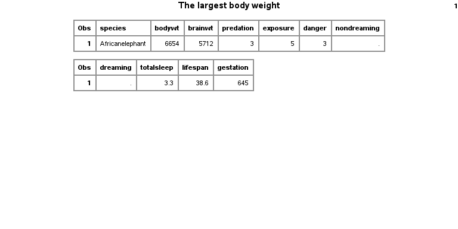

### hw-03, question 2, code

```{}
`r sas_code_q2`
```

<div class="notes">

`r comments_q2`

</div>

### hw-03, question 2, output

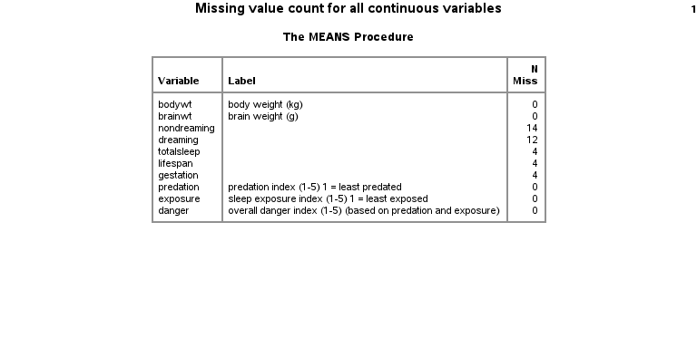

### hw-03, question 3, code

```{}
`r sas_code_q3`
```

<div class="notes">

`r comments_q3`

</div>

### hw-03, question 3, output

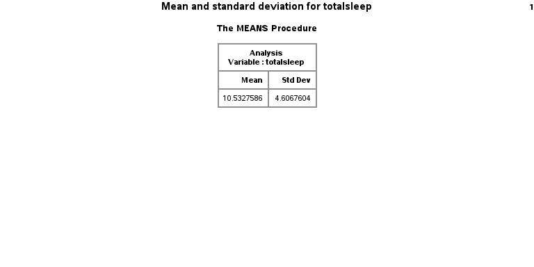

### hw-03, question 4, part a, code

```{}
`r sas_code_q4a`
```

<div class="notes">

`r comments_q4a`

</div>

### hw-03, question 4, part a, output

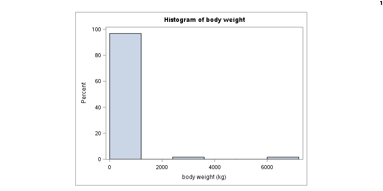

### hw-03, question 4, part b, code

```{}
`r sas_code_q4b`
```

<div class="notes">

`r comments_q4b`

</div>

### hw-03, question 4, part b, output


### hw-03, question 4, part c, code

```{}
`r sas_code_q4c`
```

<div class="notes">

`r comments_q4c`

</div>

### hw-03, question 4, part c, output

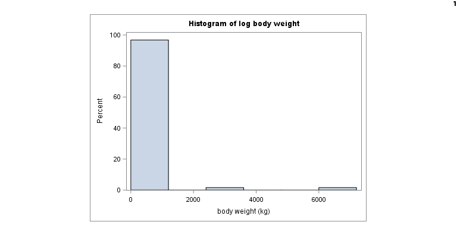

### hw-03, question 5, part a, code

```{}
`r sas_code_q5a`
```

<div class="notes">

`r comments_q5a`

</div>

### hw-03, question 5, part a, output

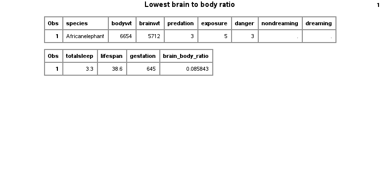

### hw-03, question 5, part b, code

```{}
`r sas_code_q5b`
```

<div class="notes">

`r comments_q5b`

</div>

### hw-03, question 5, part b, output

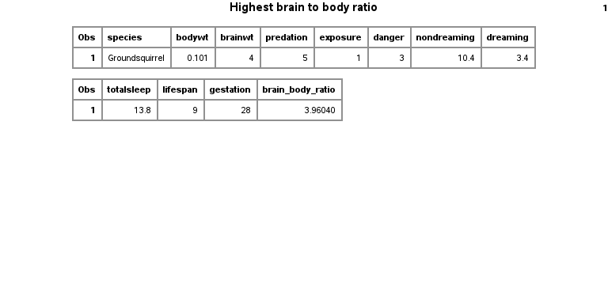

### hw-03, question 6, code

```{}
`r sas_code_q6`
```

<div class="notes">

`r comments_q6`

</div>

### hw-03, question 6, output

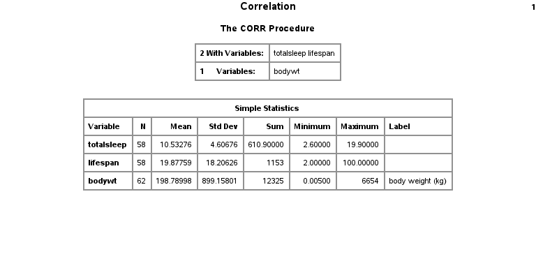

### hw-03, question 7

```{}
`r sas_code_q7a`
```

<div class="notes">

`r comments_q7a`

</div>

### hw-03, question 7

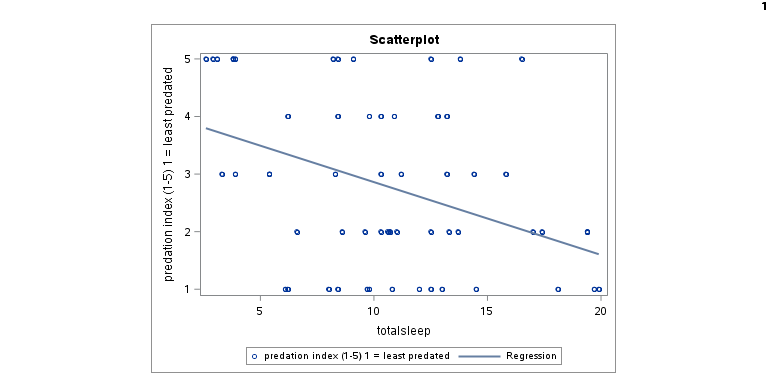


