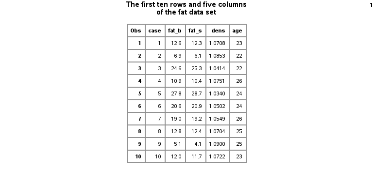
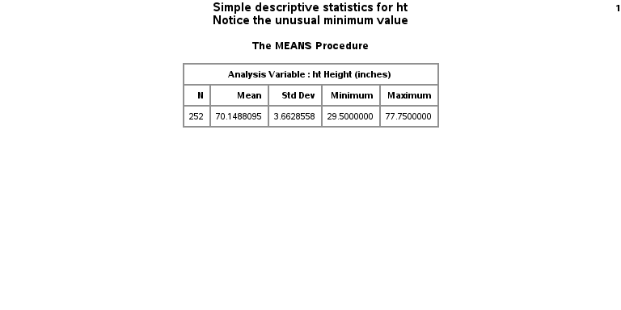
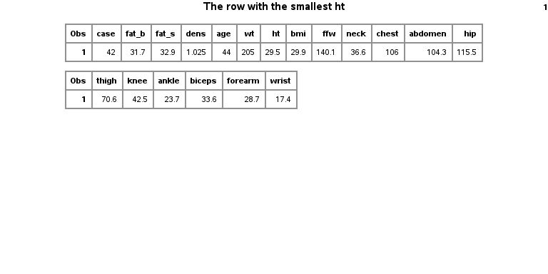

```{r setup, echo=FALSE}
knitr::opts_chunk$set(echo=FALSE, comment="")
suppressMessages(suppressWarnings(library(dplyr)))
suppressMessages(suppressWarnings(library(knitr)))
suppressMessages(suppressWarnings(library(magrittr)))
suppressMessages(suppressWarnings(library(stringr)))
shorten <- function(x) {
  if (length(x) > 14) {
    x <- append(x[1:13], "...")
  }
  return(x)
}
comments <- function(i) {
  if ((i > length(comments_beg)) | (i > length(comments_end))) return("Error. No comments.")
  txt %>%
    extract(comments_beg[i]:comments_end[i]) %>%
    paste(collapse="\n")
}
footnote <- function(i) {
  if ((i > length(footnote_beg)) | (i > length(footnote_end))) return("Error. No footnote.")
  txt %>%
    extract(footnote_beg[i]:footnote_end[i]) %>%
    paste(collapse="\n")
}
sas_code <- function(i) {
  if ((i > length(sas_code_beg)) | (i > length(sas_code_end))) return("Error. No sas code.")
  txt %>%
    extract(sas_code_beg[i]:sas_code_end[i]) %>%
    shorten %>%
    append("```{}", 0) %>% 
    append("```") %>% 
    paste(collapse="\n")
}
```

```{r code-03-01-read-fat-data.sas}
opts_current$get("label") %>%
  readLines() -> txt
txt %>% 
  str_which(fixed("*********")) %>%
  append(-1, 0) -> b
n <- length(b)
sas_code_beg <- str_which(txt, fixed("**** sas code below")) + 2
sas_code_end <- str_which(txt, fixed("**** sas code above")) - 2
comments_beg <- str_which(txt, fixed("**** comments below")) + 2
comments_end <- str_which(txt, fixed("**** comments above")) - 2
footnote_beg <- str_which(txt, fixed("**** footnote below")) + 2
footnote_end <- str_which(txt, fixed("**** footnote above")) - 2

```

## code-03-01-readfat-data.sas, part 1

`r sas_code(1)`

<div class="notes">

`r comments(1)`

</div>

## code-03-01-readfat-data.sas, part 2

`r sas_code(2)`

<div class="notes">

`r comments(2)`

</div>

## code-03-01-readfat-data.sas, part 3

`r sas_code(3)`

<div class="notes">

`r comments(3)`

</div>

## code-03-01-readfat-data.sas, part 4

`r sas_code(4)`

<div class="notes">

`r comments(4)`

</div>

## code-03-01-readfat-data.sas, part 5

`r sas_code(5)`

<div class="notes">

`r comments(5)`

</div>

## code-03-01-readfat-data.sas, ouptut page 1



<div class="notes">

`r footnote(1)`

</div>

## code-03-01-readfat-data.sas, part 6

`r sas_code(6)`

<div class="notes">

`r comments(6)`

</div>

## code-03-01-readfat-data.sas, ouptut page 2



<div class="notes">

`r footnote(2)`

</div>

## code-03-01-readfat-data.sas, part 7

`r sas_code(7)`

<div class="notes">

`r comments(7)`

</div>

## code-03-01-readfat-data.sas, ouptut page 3



<div class="notes">

`r footnote(3)`

</div>

